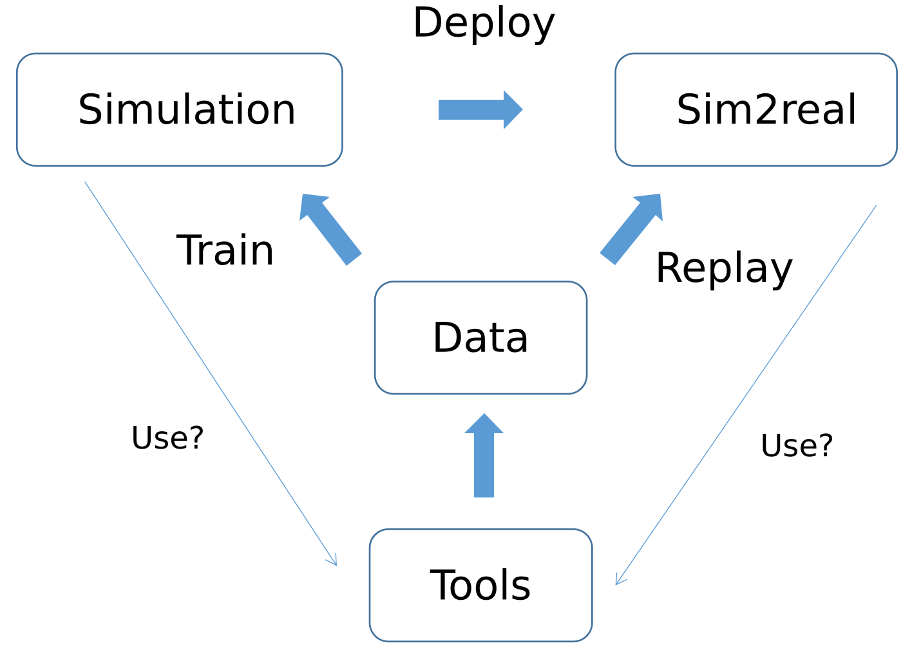

[](https://docs.omniverse.nvidia.com/isaacsim/latest/overview.html)
[](https://isaac-sim.github.io/IsaacLab/)
[](https://github.com/Genesis-Embodied-AI/Genesis)

# HumanoidVerse3 
Developed based on [HumanoidVerse ](README_V1.md) and [HumanoidVerse2](README_V2.md) please refer to [HumanoidVerse ](README_HumanoidVerse.md) and for environment settings and initial operation.  

Aiming to handle issues of different versions and dependencies, debug and integrate the sim2real part, and finally add some Motion conversion methods and data.

<p align="center">
  
</p>

[HumanoidVerse3 中文 ](README_V3_zh.md)

# Pre beginning
Different simulation environments and even real robot environments are isolated from each other, which means you can test the model using only one simulation environment or directly on the real robot. When using it, you need to manage it with a virtual environment management tool (such as Conda). Before switching the simulator, you need to activate the corresponding simulation environment.

For each virtual env, please refresh the index:
```bash
conda activate each_of_your_env

pip install -e .
```

For other training commands
```bash
conda activate yourenv

other commands

conda activate/deactivate
```

# Training
Please refer to the training instruction document.

[Commands](Commands.md)


# Sim2real
After training, please conduct tests in simulators based on Isaac and Mujoco series (such as Isaac Gym, Isaac Sim, Genesis, etc.) respectively. If the performance meets expectations and remains basically consistent, sim2real deployment testing can be carried out.

This repository includes a simplified sim2real repository **Humanoid_robot_deployment**. For the original version, please refer to
[Humanoid_robot_deployment](https://github.com/YixFeng/Humanoid_robot_deployment)

For testing commands:
[Commands](Commands.md)


# Motion
To extract motion from videos and perform conversions from datasets, please refer to [PBHC](https://github.com/TeleHuman/PBHC).
The repository will update some scripts for conversion in the future.

# Reference
Thanks to the following authors

```bibtex
@misc{HumanoidVerse2,
  author = {liangjun},
  title = {HumanoidVerse2: A Multi-Simulator Framework with Modular Design for Humanoid Robot Sim-to-Real Learning},
  year = {2025},
  publisher = {GitHub},
  journal = {GitHub repository},
  howpublished = {\url{https://github.com/zengliangjun/HumanoidVerse2}},
}

@misc{HumanoidVerse,
  author = {CMU LeCAR Lab},
  title = {HumanoidVerse: A Multi-Simulator Framework for Humanoid Robot Sim-to-Real Learning},
  year = {2025},
  publisher = {GitHub},
  journal = {GitHub repository},
  howpublished = {\url{https://github.com/LeCAR-Lab/HumanoidVerse}},
}

@article{xie2025kungfubot,
  title={KungfuBot: Physics-Based Humanoid Whole-Body Control for Learning Highly-Dynamic Skills},
  author={Xie, Weiji and Han, Jinrui and Zheng, Jiakun and Li, Huanyu and Liu, Xinzhe and Shi, Jiyuan and Zhang, Weinan and Bai, Chenjia and Li, Xuelong},
  journal={arXiv preprint arXiv:2506.12851},
  year={2025}
}

@misc{Humanoid_robot_deployment,
  author = {Yixiao Feng, Yuetong Fang},
  title = {Humanoid_robot_deployment},
  year = {2025},
  publisher = {GitHub},
  journal = {GitHub repository},
  howpublished = {\url{https://github.com/YixFeng/Humanoid_robot_deployment}},
}

```
# Citation
For HumanoidVerse3:
```bibtex
@misc{HumanoidVerse3,
  author = {Qiwei Wu},
  title = {HumanoidVerse3},
  year = {2025},
  publisher = {GitHub},
  journal = {GitHub repository},
  howpublished = {\url{https://github.com/nathanwu7/HumanoidVerse3}},
}
```
# License

This project is licensed under the MIT License - see the [LICENSE](LICENSE) file for details.


